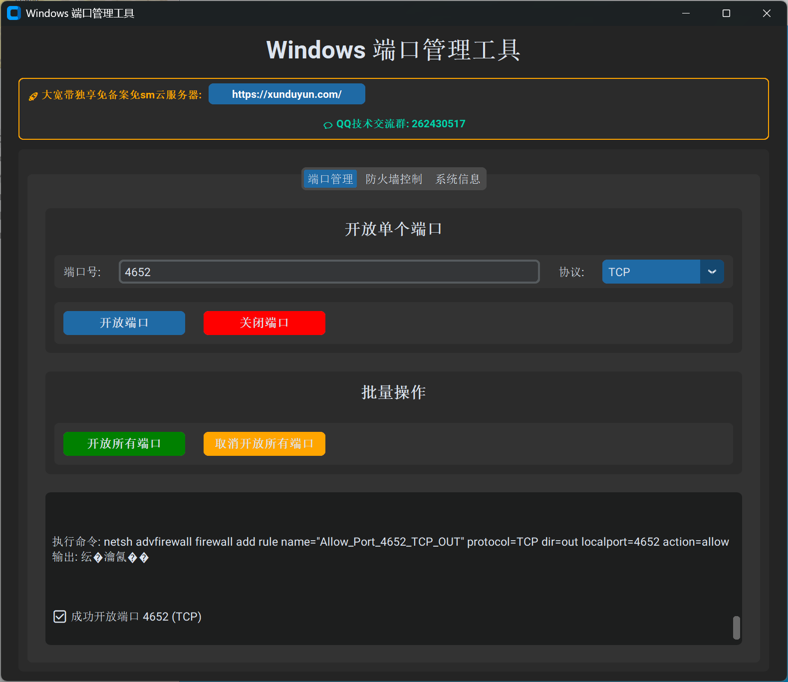

# Windows 端口管理工具

一个功能强大的Windows端口管理和防火墙控制工具，采用现代化的GUI界面设计。

## 🖼️ 程序截图



*现代化的暗色主题界面，支持端口管理、防火墙控制和系统信息查看*

## 功能特性

✨ **主要功能**
- 🔌 **端口管理**: 开放/关闭单个或批量端口
- 🛡️ **防火墙控制**: 启用/禁用Windows防火墙
- 📊 **系统信息**: 实时查看网络配置信息
- 🎯 **协议支持**: TCP、UDP或两者同时
- 🚀 **批量操作**: 一键开放/关闭所有端口
- 🔐 **权限管理**: 自动检测和请求管理员权限

✨ **界面特性**
- 🌙 **现代暗色主题**: 类似Web界面的现代化设计
- 📱 **响应式布局**: 自适应窗口大小
- 🎨 **美观易用**: CustomTkinter现代化组件
- 📝 **实时日志**: 详细的操作反馈和状态显示
- 🔗 **集成广告**: 支持云服务器推荐和技术交流群

## 系统要求

- Windows 7/8/10/11 (推荐64位)
- 管理员权限（用于端口和防火墙操作）
- Python 3.7+ （仅源码运行需要）

## 🚀 快速开始

### 方式一：直接运行可执行文件（推荐）

1. 从Releases页面下载 `Windows端口管理工具.exe` (26.8MB)
2. 右键选择"以管理员身份运行"
3. 开始使用！

> 注：由于文件较大，exe文件将在Releases中单独提供下载

### 方式二：从源码运行

1. 克隆仓库:
   ```bash
   git clone https://github.com/yourusername/windows-port-manager.git
   cd windows-port-manager
   ```

2. 运行启动脚本:
   ```bash
   # 双击运行或在命令行执行
   run.bat
   ```

3. 或手动安装依赖并运行:
   ```bash
   pip install customtkinter pillow
   python main.py
   ```

## 📋 使用说明

### 🔌 端口管理
- **单个端口**: 输入端口号，选择协议（TCP/UDP/Both），点击开放或关闭
- **批量端口**: 点击"开放所有端口"或"取消开放所有端口"进行批量操作
- **协议选择**: 支持TCP、UDP或同时配置两种协议

### 🛡️ 防火墙控制
- **查看状态**: 实时显示当前防火墙状态
- **启用/禁用**: 一键控制Windows防火墙开关
- **状态监控**: 自动检测防火墙状态变化

### 📊 系统信息
- **网络配置**: 查看IP配置、DNS设置等
- **实时刷新**: 点击刷新按钮获取最新信息
- **详细信息**: 显示网络适配器详细配置

## ⚠️ 安全提醒

**重要安全提示**:
- 开放端口可能带来安全风险，请谨慎操作
- 建议只开放必要的端口
- 不建议在生产环境中开放所有端口
- 使用后请及时关闭不需要的端口

## 🛠️ 技术特性

- **编程语言**: Python 3.13
- **GUI框架**: CustomTkinter (现代化Tkinter)
- **图像处理**: Pillow
- **系统调用**: Windows netsh命令
- **权限检测**: Windows UAC集成
- **编码支持**: 完美支持中文Windows系统
- **打包工具**: PyInstaller

## 🔧 编译说明

如需自行编译exe文件:

```bash
pip install pyinstaller customtkinter pillow
pyinstaller --onefile --windowed --name="Windows端口管理工具" --hidden-import=PIL --hidden-import=customtkinter main.py
```

编译后的文件在 `dist/` 目录中。

## ❓ 常见问题

**Q: 运行时提示需要管理员权限？**
A: 端口和防火墙操作需要管理员权限，请右键选择"以管理员身份运行"

**Q: 开放端口失败？**
A: 请确保以管理员身份运行，并检查Windows防火墙状态

**Q: 程序界面显示异常？**
A: 请确保系统支持CustomTkinter，建议更新到最新版本的Windows

**Q: exe文件可以在其他电脑上运行吗？**
A: 可以！exe文件是独立的，包含所有依赖，可以在任何Windows电脑上运行

## 📝 更新日志

### v1.0 (2025-06-17)
- ✅ 首个正式版本发布
- ✅ 完整的端口管理功能
- ✅ 防火墙控制功能
- ✅ 系统信息查看
- ✅ 现代化GUI界面
- ✅ 独立可执行文件 (26.8MB)
- ✅ 支持中文界面和编码
- ✅ 自动UAC权限提升
- ✅ 线程安全的UI操作

## 📁 项目结构

```
windows-port-manager/
├── main.py              # 主程序文件
├── run.bat              # 启动脚本
├── README.md            # 项目说明
├── 使用说明.txt          # 使用说明
├── cs1.jpg              # 程序截图
├── dist/                # 编译输出目录
│   └── Windows端口管理工具.exe  # 可执行文件 (26.8MB)
└── .gitignore           # Git忽略文件
```

## 📄 许可证

MIT License - 详见 [LICENSE](LICENSE) 文件

## 🤝 支持与反馈

- 🌐 **云服务器推荐**: [https://xunduyun.com/](https://xunduyun.com/)
- 💬 **QQ技术交流群**: 262430517
- 🐛 **问题反馈**: 请在GitHub Issues中提交
- ⭐ **如果觉得有用，请给个Star！**

---

**免责声明**: 本工具仅供学习和合法用途使用，使用者需对自己的行为负责。 